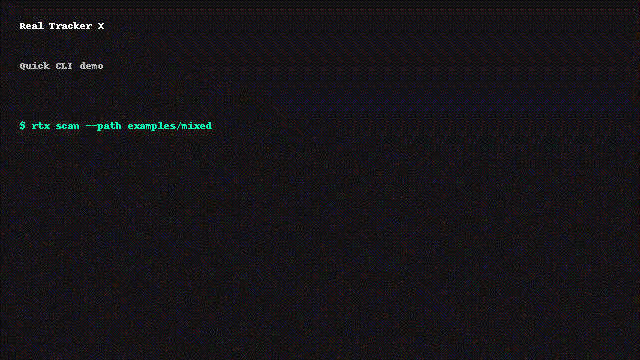

# rtx — Real Tracker X


**Author:** Andreas Fahl  
**Tagline:** Cross-ecosystem dependency trust scanner for secure upgrades.

## Problem
Modern software supply chains depend on sprawling, fast-moving dependency graphs. Teams struggle to evaluate risk before upgrading, face alert fatigue from siloed advisories, and lack unified visibility across ecosystems. Compromised maintainers, typosquats, and abandoned packages frequently slip past point-in-time audits.

## Solution
rtx pre-computes the blast radius of any change. It ingests manifests from Python, JavaScript, Java, Rust, Go, PHP, .NET, Ruby, Conda, and Homebrew projects, builds a full dependency tree, enriches it with OSV and GitHub advisories, and evaluates trust using transparent heuristics (abandonment, churn, maintainer health, typosquats). Reports yield deterministic exit codes for CI and can be exported as Rich tables, JSON, or HTML bundles.

## Demo (10s Asciinema)
[](docs/demo.md)

## Installation
```bash
pip install rtx-trust
```

> Requires Python 3.11 or newer. Use a virtual environment or tools like `uv`, Poetry, Conda, or `pipx` to manage interpreters and isolation.

### Environment managers
- **uv** — install the CLI as an isolated tool that tracks updates automatically:
  ```bash
  uv tool install --python 3.11 rtx-trust
  ```
  This keeps `rtx` on your `PATH` without polluting the active environment and lets you pin the interpreter version used to run the scanner. citeturn2search0
- **Poetry** — add `rtx-trust` to an existing project and capture it in `poetry.lock`:
  ```bash
  poetry add rtx-trust
  ```
  Poetry resolves the dependency and updates both `pyproject.toml` and the lock file automatically. citeturn0search1
- **Conda / Mamba** — create an environment with a modern Python, then install via the environment’s pip so the package stays isolated:
  ```bash
  conda create -n rtx python=3.11 pip
  conda activate rtx
  python -m pip install rtx-trust
  ```
  Always install pip-based dependencies after your conda packages to avoid solver conflicts. citeturn1search1

## Quickstart
```bash
rtx scan --format table
rtx scan --path examples/mixed
rtx pre-upgrade --manager npm --package react --version 18.0.0
rtx report --format json --output reports/rtx.json
```

## Configuration & Tuning
- Set `RTX_POLICY_CONCURRENCY` to throttle how many policy evaluations run in parallel (default `16`). Lower the value when scanning inside constrained CI runners or behind strict rate limits.
- Network-bound clients honor `RTX_HTTP_TIMEOUT` (seconds, default `5.0`) and `RTX_HTTP_RETRIES` (non-negative integer, default `2`) to tune resilience versus responsiveness.
- Set `RTX_GITHUB_MAX_CONCURRENCY` to bound concurrent GitHub Security API requests (default `6`).
- Toggle `RTX_DISABLE_GITHUB_ADVISORIES=1` when running in air-gapped or rate-limited environments to skip GitHub lookups entirely.
- Control OSV batching with `RTX_OSV_BATCH_SIZE` (default `18`), cap the in-memory OSV cache with `RTX_OSV_CACHE_SIZE` (default `512`), and bound concurrent OSV API requests via `RTX_OSV_MAX_CONCURRENCY` (default `4`).
- Lockfile detection covers `poetry.lock`, `uv.lock`, and `environment.yml` so mixed-language workspaces are fully scanned without manual manifest hints.
- CLI format switches are validated directly by argparse. Passing an unsupported format (for example `--format pdf`) exits with an actionable error before any network calls occur.
- Providing an unknown package manager via `--manager` now fails fast with the offending name, making misconfigurations obvious during automation.

## CLI Overview
- `rtx scan`: Detect manifests in the current directory, build the dependency graph, and score trust.
- `rtx pre-upgrade`: Simulate dependency upgrades and compare trust deltas before applying.
- `rtx report`: Render persisted reports in JSON, table, or HTML formats for CI workflows.
- `rtx list-managers`: List supported package managers, manifest file patterns, and detection confidence.

## Library API
```python
from pathlib import Path
from rtx.api import scan_project
report = scan_project(Path("./my-service"), managers=["npm", "pypi"])
print(report.summary())
```

## Examples
- `examples/npm`: Node.js service with npm lockfiles.
- `examples/pypi`: Python project using `pyproject.toml` and `uv.lock`.
- `examples/mixed`: Polyglot workspace combining npm, Poetry, Maven, Cargo, and Docker.

## Architecture
- Modular scanners per ecosystem share a common threat-evaluation core.
- Advisory providers (OSV, GitHub, ecosystem feeds) run asynchronously with caching.
- Trust policy engine computes risk scores and exit codes.
- SBOM generator emits CycloneDX v1.5 for every scan and pre-upgrade run.

## Security Notes
- No install scripts are executed; all metadata resolution is offline-first with bounded timeouts.
- All dependencies are vendored with hashes; CI blocks on unpinned packages.
- Releases publish signed wheels, SBOMs, and SLSA provenance via GitHub OIDC + cosign.

## Roadmap
1. Artifact attestation for container images.
2. Native integrations for Maven Enforcer and Gradle.
3. Streaming trust dashboards with anomaly alerts.
4. Workspace diff views for GitHub, GitLab, and Bitbucket Apps.

## FAQ
**Why another dependency scanner?** rtx focuses on pre-upgrade guardrails, not post-incident triage.  
**Does it phone home?** No. Network requests are limited to advisories and metadata endpoints; they respect enterprise proxies.  
**Can I extend support?** Yes. Create a plugin under `src/rtx/scanners` and register it in `rtx.registry`.  
**How do exit codes map to severity?** 0 = safe, 1 = medium trust gaps, 2 = high/critical risk.

## Community & Support
- Read the [Code of Conduct](CODE_OF_CONDUCT.md).
- See [CONTRIBUTING.md](CONTRIBUTING.md) for onboarding.
- File security issues via [SECURITY.md](SECURITY.md) or /.well-known/security.txt.
- Discussions and roadmaps live under GitHub Discussions.

## Author Attribution
Copyright © 2025 Andreas Fahl.
